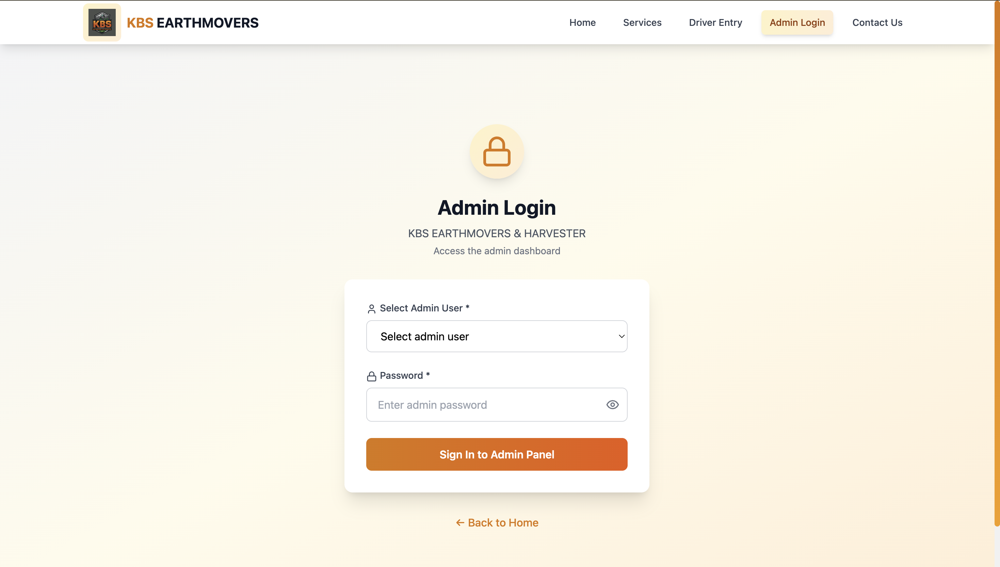
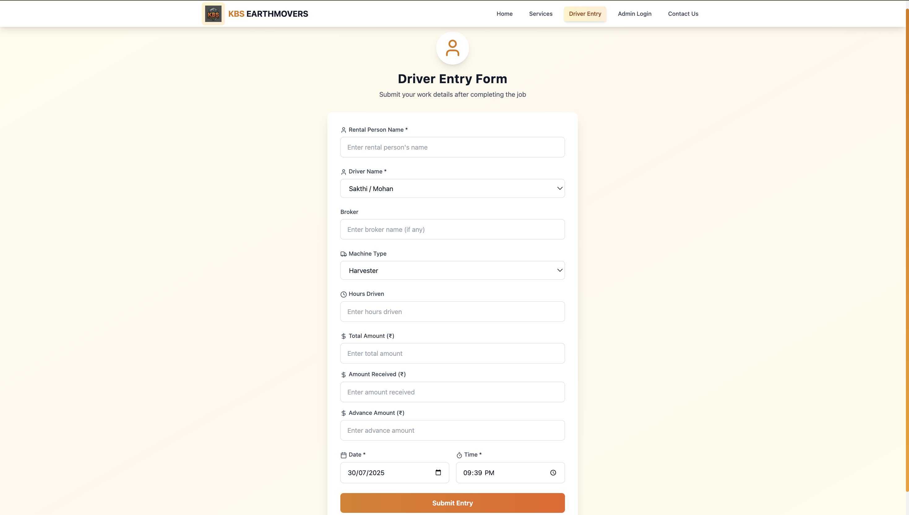

# 🚜 KBS EARTHMOVERS & HARVESTER

> **Professional Heavy Machinery Rental Management System**

[](https://reactjs.org/)
[](https://www.typescriptlang.org/)
[](https://tailwindcss.com/)
[](https://supabase.com/)
[](https://vitejs.dev/)
[](LICENSE)

---

## 📋 Table of Contents

- [🚀 Overview](#-overview)
- [✨ Features](#-features)
- [🛠️ Tech Stack](#️-tech-stack)
- [📱 Screenshots](#-screenshots)
- [🚀 Getting Started](#-getting-started)
- [📁 Project Structure](#-project-structure)
- [🔧 Configuration](#-configuration)
- [📊 Database Schema](#-database-schema)
- [🧪 Testing](#-testing)
- [🚀 Deployment](#-deployment)
- [🤝 Contributing](#-contributing)
- [📄 License](#-license)
- [📞 Contact](#-contact)

---

## 🚀 Overview

**KBS EARTHMOVERS & HARVESTER** is a comprehensive web-based management system designed for heavy machinery rental businesses. This modern React application provides efficient tools for managing work entries, driver submissions, broker transactions, and administrative operations.

### 🎯 **Key Business Areas**
- **JCB Services** - Excavation and construction work
- **Tractor Rental** - Agricultural and land preparation
- **Harvester Services** - Crop harvesting and processing

---

## ✨ Features

### 🏠 **Public Pages**
- **Homepage** - Professional landing page with service overview
- **Services** - Detailed service descriptions and specifications
- **Contact** - Business information and contact details
- **Driver Entry** - Mobile-friendly work entry submission

### 🔐 **Admin Panel**
- **Multi-User Authentication** - Secure admin login system
- **Work Entry Management** - CRUD operations for work entries
- **Broker Entry Management** - Dedicated broker transaction tracking
- **Advanced Filtering** - Date, machine type, driver, and search filters
- **Real-time Updates** - Live data synchronization
- **Export Functionality** - Excel and PDF report generation
- **Responsive Design** - Mobile-optimized admin interface

### 📊 **Analytics & Reporting**
- **Dashboard Statistics** - Real-time business metrics
- **Financial Tracking** - Total amounts, received payments, balances
- **Hour Tracking** - Work hours and machine utilization
- **Export Reports** - Professional Excel and PDF exports

---

## 🛠️ Tech Stack

| Category | Technology | Version |
|----------|------------|---------|
| **Frontend** | React | 18.0.0 |
| **Language** | TypeScript | 5.0.0 |
| **Styling** | Tailwind CSS | 3.3.0 |
| **Build Tool** | Vite | 4.4.0 |
| **Backend** | Supabase | 2.0.0 |
| **Database** | PostgreSQL | Latest |
| **Authentication** | Supabase Auth | Built-in |
| **Real-time** | Supabase Realtime | Built-in |
| **Icons** | Lucide React | Latest |
| **Forms** | React Hook Form | Latest |
| **Date Handling** | date-fns | Latest |
| **PDF Generation** | jsPDF | Latest |
| **Excel Export** | SheetJS | Latest |

---

## 📱 Screenshots

### 🏠 Homepage


### 🔐 Admin Dashboard


### 📝 Driver Entry Form


---

## 🚀 Getting Started

### 📋 Prerequisites

- **Node.js** (v16 or higher)
- **npm** or **yarn**
- **Supabase Account** (for backend services)

### 🔧 Installation

1. **Clone the repository**
   ```bash
   git clone https://github.com/SHRIKAVIN/kbsearthmovers.git
   cd kbsearthmovers
   ```

2. **Install dependencies**
   ```bash
   npm install
   # or
   yarn install
   ```

3. **Environment Setup**
   ```bash
   cp .env.example .env.local
   ```
   
   Update `.env.local` with your Supabase credentials:
   ```env
   VITE_SUPABASE_URL=your_supabase_url
   VITE_SUPABASE_ANON_KEY=your_supabase_anon_key
   ```

4. **Database Setup**
   ```bash
   # Run Supabase migrations
   npx supabase db push
   ```

5. **Start Development Server**
   ```bash
   npm run dev
   # or
   yarn dev
   ```

6. **Open Application**
   ```
   http://localhost:5173
   ```

---

## 📁 Project Structure

```
kbsearthmovers/
├── 📁 public/                 # Static assets
│   ├── 📁 icons/             # App icons
│   ├── 🖼️ harvester.png      # Service images
│   ├── 🖼️ jcb.png           # Service images
│   ├── 🖼️ tractor.png       # Service images
│   └── 📄 manifest.json      # PWA manifest
├── 📁 src/                   # Source code
│   ├── 📁 components/        # Reusable components
│   │   └── 🧭 Navbar.tsx     # Navigation component
│   ├── 📁 pages/            # Page components
│   │   ├── 🏠 HomePage.tsx   # Landing page
│   │   ├── 🔧 ServicesPage.tsx # Services page
│   │   ├── 📞 ContactPage.tsx # Contact page
│   │   ├── 📝 DriverEntryPage.tsx # Driver entry form
│   │   ├── 🔐 AdminLogin.tsx # Admin authentication
│   │   └── 📊 AdminPanel.tsx # Admin dashboard
│   ├── 📁 lib/              # Utility libraries
│   │   └── 🔗 supabase.ts   # Supabase configuration
│   ├── 🎨 index.css         # Global styles
│   ├── 🚀 main.tsx          # Application entry point
│   └── 📱 App.tsx           # Main app component
├── 📁 supabase/             # Database migrations
│   └── 📁 migrations/       # SQL migration files
├── 📄 package.json          # Dependencies and scripts
├── 📄 vite.config.ts        # Vite configuration
├── 📄 tailwind.config.js    # Tailwind CSS configuration
└── 📄 README.md             # Project documentation
```

---

## 🔧 Configuration

### Environment Variables

Create a `.env.local` file in the root directory:

```env
# Supabase Configuration
VITE_SUPABASE_URL=your_supabase_project_url
VITE_SUPABASE_ANON_KEY=your_supabase_anon_key

# Application Settings
VITE_APP_NAME=KBS EARTHMOVERS
VITE_APP_VERSION=1.0.0
```

### Tailwind CSS Configuration

The project uses Tailwind CSS with custom configurations:

```javascript
// tailwind.config.js
module.exports = {
  content: ["./src/**/*.{js,jsx,ts,tsx}"],
  theme: {
    extend: {
      colors: {
        amber: {
          50: '#fffbeb',
          // ... custom amber palette
        }
      },
      animation: {
        'fade-in-up': 'fadeInUp 0.5s ease-out',
        'slide-in-left': 'slideInLeft 0.5s ease-out',
        'slide-in-right': 'slideInRight 0.5s ease-out',
      }
    }
  },
  plugins: []
}
```

---

## 📊 Database Schema

### Work Entries Table
```sql
CREATE TABLE work_entries (
  id UUID DEFAULT gen_random_uuid() PRIMARY KEY,
  rental_person_name TEXT NOT NULL,
  driver_name TEXT NOT NULL,
  broker TEXT,
  machine_type TEXT NOT NULL DEFAULT 'Harvester',
  hours_driven DECIMAL(5,2) DEFAULT 0,
  total_amount DECIMAL(10,2) DEFAULT 0,
  amount_received DECIMAL(10,2) DEFAULT 0,
  advance_amount DECIMAL(10,2) DEFAULT 0,
  date DATE NOT NULL,
  time TIME,
  entry_type TEXT NOT NULL DEFAULT 'driver',
  created_at TIMESTAMP WITH TIME ZONE DEFAULT NOW(),
  updated_at TIMESTAMP WITH TIME ZONE DEFAULT NOW()
);
```

### Broker Entries Table
```sql
CREATE TABLE broker_entries (
  id UUID DEFAULT gen_random_uuid() PRIMARY KEY,
  broker_name TEXT NOT NULL,
  total_hours TEXT NOT NULL,
  total_amount DECIMAL(10,2) DEFAULT 0,
  amount_received DECIMAL(10,2) DEFAULT 0,
  date DATE NOT NULL,
  time TIME,
  created_at TIMESTAMP WITH TIME ZONE DEFAULT NOW(),
  updated_at TIMESTAMP WITH TIME ZONE DEFAULT NOW()
);
```

---

## 🧪 Testing

### Running Tests
```bash
# Run all tests
npm test

# Run tests in watch mode
npm run test:watch

# Run tests with coverage
npm run test:coverage
```

### Test Structure
```
src/
├── 📁 __tests__/           # Test files
│   ├── 📁 components/      # Component tests
│   ├── 📁 pages/          # Page tests
│   └── 📁 utils/          # Utility tests
```

### Test IDs
The application includes comprehensive test IDs for all interactive elements:
- `data-testid="admin-login-page"`
- `data-testid="driver-entry-form"`
- `data-testid="submit-entry-button"`
- And many more...

---

## 🚀 Deployment

### Vercel Deployment
1. **Connect Repository**
   - Link your GitHub repository to Vercel
   - Configure environment variables

2. **Build Settings**
   ```bash
   Build Command: npm run build
   Output Directory: dist
   Install Command: npm install
   ```

3. **Environment Variables**
   - Add Supabase credentials to Vercel dashboard
   - Configure production environment

### Manual Deployment
```bash
# Build for production
npm run build

# Preview production build
npm run preview

# Deploy to your hosting provider
# Upload dist/ folder contents
```

---

## 🤝 Contributing

We welcome contributions! Please follow these steps:

1. **Fork the repository**
2. **Create a feature branch**
   ```bash
   git checkout -b feature/amazing-feature
   ```
3. **Commit your changes**
   ```bash
   git commit -m 'Add amazing feature'
   ```
4. **Push to the branch**
   ```bash
   git push origin feature/amazing-feature
   ```
5. **Open a Pull Request**

### 📋 Contribution Guidelines
- Follow TypeScript best practices
- Use meaningful commit messages
- Add tests for new features
- Update documentation as needed
- Follow the existing code style

---

## 📄 License

This project is licensed under the **MIT License** - see the [LICENSE](LICENSE) file for details.

```
MIT License

Copyright (c) 2024 KBS EARTHMOVERS

Permission is hereby granted, free of charge, to any person obtaining a copy
of this software and associated documentation files (the "Software"), to deal
in the Software without restriction, including without limitation the rights
to use, copy, modify, merge, publish, distribute, sublicense, and/or sell
copies of the Software, and to permit persons to whom the Software is
furnished to do so, subject to the following conditions:

The above copyright notice and this permission notice shall be included in all
copies or substantial portions of the Software.
```

---


## 🙏 Acknowledgments

- **React Team** - For the amazing framework
- **Supabase Team** - For the powerful backend platform
- **Tailwind CSS** - For the utility-first CSS framework
- **Vite** - For the fast build tool

---

<div align="center">

**Made with ❤️ by KBS EARTHMOVERS Team**
