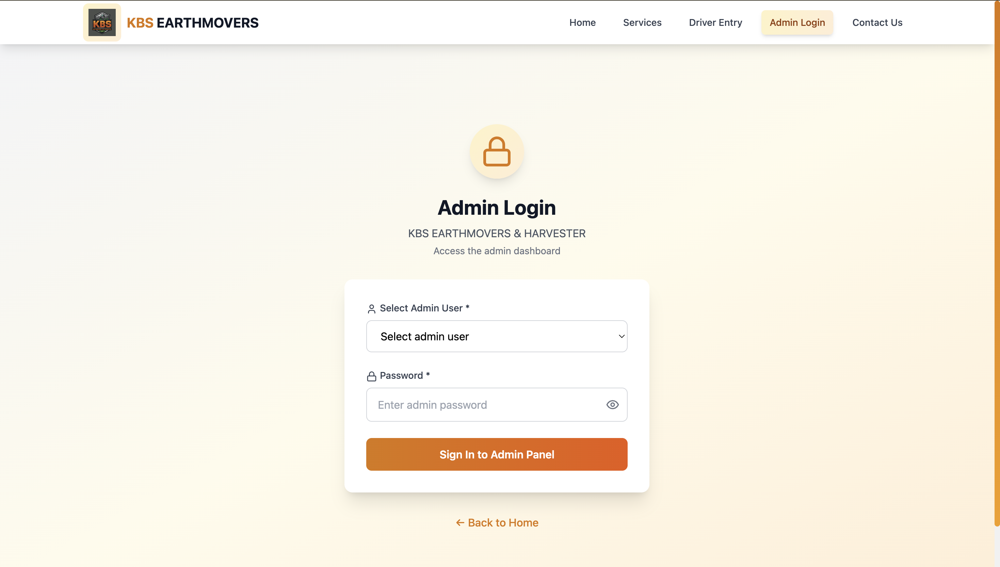
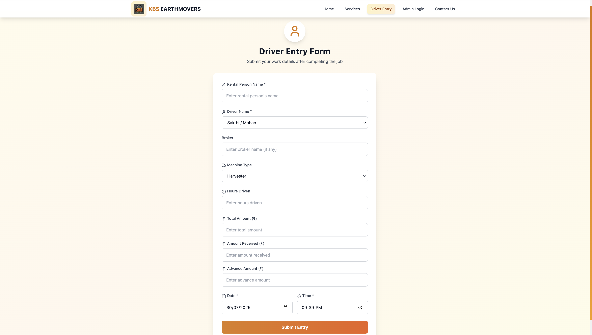

# 🚜 KBS EARTHMOVERS & HARVESTER

> **Professional Heavy Machinery Rental Management System**

[](https://reactjs.org/)
[](https://www.typescriptlang.org/)
[](https://tailwindcss.com/)
[](https://supabase.com/)
[](https://vitejs.dev/)
[](https://capacitorjs.com/)
[](LICENSE)

---

## 📋 Table of Contents

- [🚀 Overview](#-overview)
- [✨ Features](#-features)
- [🛠️ Tech Stack](#️-tech-stack)
- [🌐 Live Demo](#-live-demo)
- [📱 Screenshots](#-screenshots)
- [🚀 Getting Started](#-getting-started)
- [📁 Project Structure](#-project-structure)
- [🔧 Configuration](#-configuration)
- [💓 Database Keep-Alive](#-database-keep-alive)
- [📊 Database Schema](#-database-schema)
- [🚀 Deployment](#-deployment)
- [📱 Mobile App](#-mobile-app)
- [🤝 Contributing](#-contributing)

---

## 🚀 Overview

**KBS EARTHMOVERS & HARVESTER** is a web-based management system for heavy machinery rental businesses. It covers work entries, driver submissions, broker transactions, and admin operations for JCB, tractor, and harvester services.

### 🎯 Key Business Areas

- **JCB Services** — Excavation and construction work
- **Tractor Rental** — Agricultural and land preparation
- **Harvester Services** — Crop harvesting and processing

---

## ✨ Features

### 🏠 Public Pages

- **Homepage** — Landing page with service overview
- **Services** — Service descriptions and specifications
- **Contact** — Business information and contact details
- **Driver Entry** — Mobile-friendly work entry submission

### 🔐 Admin Panel

- **Password Authentication** — Secure admin login
- **Work Entry Management** — CRUD for work entries
- **Broker Entry Management** — Broker transaction tracking
- **Owner Filtering** — Filter by owner (Rohini / Laxmi)
- **Advanced Filtering** — Date, machine type, driver, and search
- **Real-time Updates** — Live data via Supabase
- **Export** — Excel and PDF report generation
- **Responsive Design** — Mobile-optimized admin UI

### 📊 Analytics & Reporting

- Dashboard statistics and business metrics
- Financial tracking (totals, received amounts, balances)
- Hour tracking and machine utilization
- Excel and PDF exports

---

## 🛠️ Tech Stack

| Category | Technology | Version |
|----------|------------|---------|
| **Frontend** | React | 18.3 |
| **Language** | TypeScript | 5.5 |
| **Styling** | Tailwind CSS | 3.4 |
| **Build Tool** | Vite | 5.4 |
| **Backend** | Supabase | 2.38 |
| **Database** | PostgreSQL | Latest |
| **Mobile** | Capacitor | 7.4 |
| **PWA** | vite-plugin-pwa | 1.0 |
| **Icons** | Lucide React | Latest |
| **Forms** | React Hook Form | Latest |
| **Date Handling** | date-fns | Latest |
| **PDF Generation** | jsPDF | Latest |
| **Excel Export** | SheetJS (xlsx) | Latest |

---

## 🌐 Live Demo

**[👉 View Live Demo](https://kbsearthmovers.vercel.app/)**

### Features to Explore

- Public pages: Homepage, Services, Contact, Driver Entry
- Admin panel: Work entries, broker transactions, reports
- Real-time updates and Excel/PDF exports
- Responsive, mobile-friendly UI

---

## 📱 Screenshots

### Homepage


### Admin Dashboard


### Driver Entry Form


---

## 🚀 Getting Started

### Prerequisites

- **Node.js** (v18 or higher recommended)
- **npm** or **yarn**
- **Supabase** account (for backend)

### Installation

1. **Clone the repository**
   ```bash
   git clone https://github.com/SHRIKAVIN/kbsearthmovers.git
   cd kbsearthmovers
   ```

2. **Install dependencies**
   ```bash
   npm install
   ```

3. **Environment setup**
   ```bash
   cp .env.example .env.local
   ```

   Update `.env.local`:
   ```env
   VITE_SUPABASE_URL=your_supabase_url
   VITE_SUPABASE_ANON_KEY=your_supabase_anon_key
   VITE_ADMIN_PASSWORD=your_secure_admin_password
   ```

4. **Database setup**
   ```bash
   npx supabase db push
   ```

5. **Start the dev server**
   ```bash
   npm run dev
   ```

6. Open [http://localhost:5173](http://localhost:5173)

---

## 📁 Project Structure

```
kbsearthmovers/
├── api/
│   └── keep-alive.ts          # Vercel serverless keep-alive endpoint
├── .github/workflows/
│   └── keep-alive.yml         # Cron job to ping keep-alive + Teams alerts
├── android/ / ios/            # Capacitor native projects
├── public/                    # Static assets, icons, PWA manifest
├── src/
│   ├── components/
│   │   ├── Navbar.tsx
│   │   └── StatsSection.tsx
│   ├── hooks/
│   │   └── useMobileOptimizations.ts
│   ├── pages/
│   │   ├── HomePage.tsx
│   │   ├── ServicesPage.tsx
│   │   ├── ContactPage.tsx
│   │   ├── DriverEntryPage.tsx
│   │   ├── AdminLogin.tsx
│   │   └── AdminPanel.tsx
│   ├── lib/
│   │   └── supabase.ts
│   ├── App.tsx
│   ├── main.tsx
│   └── index.css
├── supabase/migrations/       # SQL migrations
├── capacitor.config.ts
├── vercel.json
├── vite.config.ts
└── package.json
```

---

## 🔧 Configuration

### Environment Variables

**Local (`.env.local`):**

```env
VITE_SUPABASE_URL=your_supabase_project_url
VITE_SUPABASE_ANON_KEY=your_supabase_anon_key
VITE_ADMIN_PASSWORD=your_secure_admin_password
```

**Vercel (production):**

| Variable | Required | Notes |
|----------|----------|-------|
| `VITE_SUPABASE_URL` | Yes | Supabase project URL |
| `VITE_SUPABASE_ANON_KEY` | Yes | Anon/public key |
| `VITE_ADMIN_PASSWORD` | Yes | Admin login password |
| `SUPABASE_URL` | Recommended | Used by `/api/keep-alive` |
| `SUPABASE_SERVICE_ROLE_KEY` | **Yes** | Required by all payment endpoints; also preferred for keep-alive |
| `SUPABASE_ANON_KEY` | Optional | Fallback if service role is not set |
| `KEEP_ALIVE_TABLE` | Optional | Defaults to `work_entries` |
| `TEAMS_WEBHOOK_URL` | Optional | Teams alerts for keep-alive and for every payment received |

**Cashfree payments (server-side only):**

> ⚠️ None of these may be prefixed with `VITE_`. Vite inlines every `VITE_*` variable
> into the browser bundle, which would publish your Cashfree secret to every visitor.

| Variable | Required | Notes |
|----------|----------|-------|
| `CASHFREE_CLIENT_ID` | Yes | Cashfree App ID |
| `CASHFREE_CLIENT_SECRET` | Yes | Cashfree Secret Key |
| `CASHFREE_ENV` | Yes | `sandbox` or `production` |
| `CASHFREE_WEBHOOK_SECRET` | Optional | Defaults to `CASHFREE_CLIENT_SECRET` |
| `CASHFREE_API_VERSION` | Optional | Defaults to `2026-01-01` |
| `PUBLIC_BASE_URL` | Recommended | Origin for Cashfree `return_url` / `notify_url` |
| `CRON_SECRET` | Recommended | Lets you trigger the reminder sweep manually |
| `VERCEL_AUTOMATION_BYPASS_SECRET` | Preview only | Lets Cashfree's webhook through a preview that has Vercel Authentication on. Leave unset in production. |
| `VITE_PUBLIC_SITE_URL` | Recommended | Production origin encoded into the printed QR sticker. Defaults to `https://kbsearthmovers.vercel.app`. Never set this to a preview URL. |

---

## 💳 Payments

Two ways a customer can pay, both settling into the same ledger.

**1. Driver collects on site.** The driver saves an entry (customer mobile is now
required), taps **Collect Payment Now**, and a dynamic UPI QR for the exact balance
appears. The customer scans it with GPay / PhonePe / Paytm. The screen flips to *Paid*
on its own, and the balance drops live in the admin panel.

**2. The QR sticker on the harvester.** Print it from **Admin → QR Sticker**, laminate
it, and fix it to the machine. A customer scans it, enters their mobile on `/pay`, sees
what they owe, and pays in full or in part. The sticker encodes a static URL, so it
never expires.

**Reminders are off.** `api/cron/payment-reminders.ts` still exists and can send one
Cashfree payment link per customer over WhatsApp and SMS, but it is not scheduled - it
was removed from `vercel.json`. Trigger it by hand with `CRON_SECRET`, or re-add the
cron entry to turn it back on.

**Payments settle silently.** No Teams card is sent when money arrives; the record is
the `payments` row and the balance dropping in the admin panel. Only the keep-alive job
posts to Teams.

### How the money is kept correct

| Concern | How it is handled |
|---------|-------------------|
| Can a browser fake a payment? | No. `payments` has RLS on with zero policies and no `anon` grants. Only the verified webhook, running as service-role, writes payment state. |
| Can someone underpay by tampering with the request? | No. Every endpoint recomputes the balance from the database. A client-supplied amount is only honoured as a *cap* for partial payment. |
| What if Cashfree sends the same webhook twice? | `apply_payment()` returns early when the payment is already `paid`, so a replay credits nothing. |
| What if a customer pays part of what they owe? | Oldest job settles first (FIFO), with each allocation recorded in `payment_allocations`. |
| What if the webhook is spoofed? | The signature is checked (`HMAC-SHA256` over `timestamp + raw body`) before anything else. No valid signature means no database write. |

Payments credit the existing `amount_received` column, so the admin totals, the Excel
and PDF exports, and the live realtime updates all keep working unchanged.

### Cashfree setup

1. In the Cashfree dashboard, add a webhook pointing at
   `https://<your-domain>/api/webhooks/cashfree` and subscribe it to the payment
   success and failure events.
2. Set the environment variables above, starting with `CASHFREE_ENV=sandbox`.
3. Run the migration in `supabase/migrations/20260914000000_add_payments.sql`.
4. Test end to end against sandbox, then switch `CASHFREE_ENV=production` and repoint
   the webhook.

---

## 💓 Database Keep-Alive

Supabase free-tier projects pause after inactivity. This repo keeps the database awake with:

1. **`/api/keep-alive`** — Vercel serverless function that runs a lightweight `SELECT` against Supabase
2. **Vercel Cron** (`vercel.json`) — Invokes `/api/keep-alive` once daily at 03:00 UTC (Hobby-compatible) and posts success/failure cards to Microsoft Teams
3. **GitHub Actions** (`.github/workflows/keep-alive.yml`) — Manual dispatch only (scheduled cron commented out); pings the endpoint and posts success/failure cards to Microsoft Teams

### Vercel Environment Variables (keep-alive)

| Variable | Purpose |
|----------|---------|
| `SUPABASE_URL` | Supabase project URL |
| `SUPABASE_SERVICE_ROLE_KEY` | Preferred key for keep-alive queries |
| `TEAMS_WEBHOOK_URL` | Incoming webhook URL for Teams notifications from Vercel Cron |

### GitHub Secrets

| Secret | Purpose |
|--------|---------|
| `VERCEL_DEPLOYMENT_URL` | Base URL of the Vercel deployment (e.g. `https://kbsearthmovers.vercel.app`) |
| `TEAMS_WEBHOOK_URL` | Incoming webhook URL for Teams notifications |

### Manual trigger

In GitHub: **Actions → Keep Supabase Database Active → Run workflow**

### Endpoint

```
GET https://<your-vercel-url>/api/keep-alive
```

Success response example:

```json
{
  "success": true,
  "message": "Database keep-alive successful",
  "timestamp": "2026-08-04T18:00:00.000Z",
  "table": "work_entries",
  "keyType": "service_role"
}
```

---

## 📊 Database Schema

### Work Entries

```sql
CREATE TABLE work_entries (
  id UUID DEFAULT gen_random_uuid() PRIMARY KEY,
  rental_person_name TEXT NOT NULL,
  driver_name TEXT NOT NULL,
  broker TEXT,
  machine_type TEXT NOT NULL DEFAULT 'Harvester',
  hours_driven DECIMAL(5,2) DEFAULT 0,
  total_amount DECIMAL(10,2) DEFAULT 0,
  amount_received DECIMAL(10,2) DEFAULT 0,
  advance_amount DECIMAL(10,2) DEFAULT 0,
  date DATE NOT NULL,
  time TIME,
  entry_type TEXT NOT NULL DEFAULT 'driver',
  owner TEXT NOT NULL DEFAULT 'Rohini' CHECK (owner IN ('Rohini', 'Laxmi')),
  created_at TIMESTAMPTZ DEFAULT NOW(),
  updated_at TIMESTAMPTZ DEFAULT NOW()
);
```

### Broker Entries

```sql
CREATE TABLE broker_entries (
  id UUID DEFAULT gen_random_uuid() PRIMARY KEY,
  broker_name TEXT NOT NULL,
  total_hours TEXT NOT NULL,
  total_amount DECIMAL(10,2) DEFAULT 0,
  amount_received DECIMAL(10,2) DEFAULT 0,
  date DATE NOT NULL,
  time TIME,
  owner TEXT NOT NULL DEFAULT 'Rohini' CHECK (owner IN ('Rohini', 'Laxmi')),
  created_at TIMESTAMPTZ DEFAULT NOW(),
  updated_at TIMESTAMPTZ DEFAULT NOW()
);
```

Migrations live in `supabase/migrations/`.

---

## 🚀 Deployment

### Vercel

1. Connect the GitHub repo to Vercel
2. Build settings:
   ```text
   Build Command: npm run build
   Output Directory: dist
   Install Command: npm install
   ```
3. Add the environment variables listed above
4. Ensure `/api/keep-alive` can reach Supabase (service role or anon key)

### Manual

```bash
npm run build
npm run preview
# Deploy the contents of dist/ (and configure the api/ function on your host)
```

---

## 📱 Mobile App

The project includes **Capacitor** wrappers for Android and iOS (`android/`, `ios/`).

```bash
npm run build
npx cap sync
npx cap open android   # or ios
```

See [PLAY_STORE_PUBLISHING_GUIDE.md](PLAY_STORE_PUBLISHING_GUIDE.md) for Play Store publishing notes.

---

## 🤝 Contributing

1. Fork the repository
2. Create a feature branch: `git checkout -b feature/amazing-feature`
3. Commit: `git commit -m 'Add amazing feature'`
4. Push: `git push origin feature/amazing-feature`
5. Open a Pull Request

### Guidelines

- Follow TypeScript best practices
- Use meaningful commit messages
- Update documentation when behavior changes
- Match existing code style

---

<div align="center">

**Made with ❤️ by KBS EARTHMOVERS Team**

</div>
